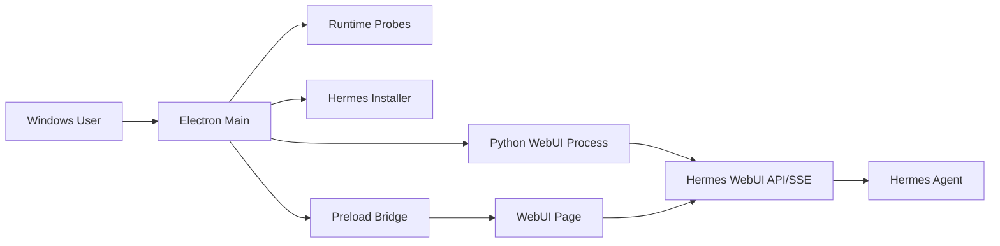

# Hermes Agent Windows Desktop PRD

## 1. 产品概述

Hermes Agent Windows Desktop 是面向 Windows 用户的 Hermes Agent 桌面客户端。它复用 `hermes-webui` 的前端页面、Python API、SSE 聊天流、会话、工作区和设置能力，并通过 Electron 提供 Windows 原生体验，包括安装检测、进程管理、日志诊断、工作区选择、托盘和后续安装包分发。

产品目标不是重写 Hermes WebUI，而是在最短路径内把现有 WebUI 变成稳定、可诊断、可分发的 Windows 桌面应用。

## 2. 目标用户

- 希望在 Windows 上使用 Hermes Agent，但不想手动管理 PowerShell、Python venv、端口和 WebUI 服务的用户。
- 已经使用 Hermes Agent CLI，希望获得更方便的桌面聊天、会话和工作区体验的用户。
- 需要本地自托管、可控、可查看日志和诊断信息的开发者用户。

## 3. 核心目标

- 一键启动：用户执行桌面应用后，自动启动本地 WebUI 内核并打开桌面窗口。
- 原生安装检测：检测 Hermes、Python、uv、Node、Git/MinGit 和 `%LOCALAPPDATA%\hermes`。
- 原生安装流程：Hermes 缺失时，可从桌面端触发官方 Windows PowerShell installer，并实时展示日志。
- WebUI 复用：聊天、session、SSE、文件浏览、模型/provider、cron、skills、memory 等能力继续由 `hermes-webui` 维护。
- 桌面增强：工作区选择、日志面板、健康检查、托盘、重启 WebUI、打开 Hermes Home、复制诊断信息。
- 可维护架构：功能拆分为小模块，禁止把主进程、preload、WebUI 服务、安装器、诊断 UI 堆进单个巨型文件。

## 4. 非目标

- 首版不重写 `hermes-webui` 为 React/Vue。
- 首版不重写 Python 后端为 Node/Electron。
- 首版不做 WSL2 主路径；WSL2 仅作为后续兼容方案。
- 首版不实现完整自动更新。
- 首版不替代 Hermes Agent CLI 的模型/provider 配置流程，只提供状态入口和诊断辅助。

## 5. 功能需求

### 5.1 桌面启动

- 应用启动后创建 Electron 主窗口。
- Electron 主进程启动 `vendor/hermes-webui/server.py`。
- WebUI 必须绑定 `127.0.0.1`，端口从 `8787` 开始自动探测。
- 主进程等待 `/health` 成功后加载 WebUI URL。
- WebUI 启动失败时展示桌面诊断页，而不是空白窗口。

验收标准：
- `npm run dev` 能启动桌面窗口。
- 端口 `8787` 被占用时能自动尝试后续端口。
- Python/WebUI 启动失败时能看到错误原因和日志按钮。

### 5.2 Hermes 安装检测

- 检测 `hermes --version`。
- 检测 `%LOCALAPPDATA%\hermes`。
- 检测 Python launcher：`py -3.11`、`py -3.12`、`py -3`、`python3`、`python`。
- 检测 `uv --version`、`node --version`、`git --version`。
- 状态统一输出给 preload API 和桌面诊断 UI。

验收标准：
- `window.hermesDesktop.getStatus()` 返回完整 runtime 状态。
- 未安装 Hermes 时状态显示 `installed=false`。
- 已安装 Hermes 或存在 `%LOCALAPPDATA%\hermes` 时状态显示可用路径。

### 5.3 Hermes 安装流程

- 桌面端提供 Install Hermes 操作。
- 主进程调用：

```powershell
irm https://raw.githubusercontent.com/NousResearch/hermes-agent/main/scripts/install.ps1 | iex
```

- stdout/stderr 通过 IPC 流式发送给渲染层。
- 安装完成后重新探测 Hermes 状态。

验收标准：
- 安装过程日志实时可见。
- 安装失败时保留日志，可复制诊断信息。
- 同一时间不能重复启动多个 installer。

### 5.4 WebUI 内核管理

- 自动创建 `vendor/hermes-webui/.venv`。
- 自动安装 `vendor/hermes-webui/requirements.txt`。
- WebUI 作为 Electron 子进程运行。
- 记录 stdout/stderr 到桌面日志。
- 支持重启 WebUI。
- 应用退出时关闭 WebUI 子进程。

验收标准：
- 干净环境下首次启动可创建 venv。
- `restartWebui()` 可停止旧进程并启动新进程。
- 日志可通过 `tailLogs()` 读取。

### 5.5 原生工作区选择

- preload 暴露 `pickWorkspace()`。
- Electron 使用 Windows 文件夹选择器。
- 选择后调用 WebUI 桌面 API 同步默认工作区。
- WebUI 新增接口仅在 `HERMES_DESKTOP=1` 时启用：
  - `GET /api/desktop/status`
  - `POST /api/desktop/workspace`

验收标准：
- 选择工作区后写入 WebUI settings/last workspace。
- 新工作区出现在 WebUI workspace 列表。
- 普通 WebUI 运行时不暴露桌面 API。

### 5.6 桌面诊断 UI

- WebUI 页面内通过 preload 注入轻量桌面浮层。
- WebUI 启动失败时展示独立诊断页。
- 诊断信息包括 Hermes 状态、WebUI 状态、端口、日志路径、运行时检查。
- 提供重启 WebUI、安装 Hermes、打开日志、打开 Hermes Home 操作。

验收标准：
- 诊断浮层不依赖 WebUI 前端框架。
- 诊断页可在 WebUI 启动失败时独立工作。
- 所有危险操作只能通过白名单 IPC 触发。

### 5.7 托盘与菜单

- 系统托盘提供显示窗口、重启 WebUI、打开日志、退出。
- 应用菜单提供重启 WebUI、打开日志、打开 Hermes Home。

验收标准：
- 关闭窗口不影响显式退出逻辑。
- 托盘操作不绕过 WebUI service 管理层。

### 5.8 安全要求

- Electron `contextIsolation=true`。
- Electron `nodeIntegration=false`。
- preload 只暴露白名单 API。
- 渲染进程不能执行任意 shell 命令。
- WebUI 只绑定 loopback。
- 桌面 API 必须受 `HERMES_DESKTOP=1` 保护。

验收标准：
- `window.require` 不可用。
- IPC channel 不接受任意命令字符串。
- `openPath()` 只允许已定义目标或显式本地路径，后续版本应收敛到 allowlist。

## 6. 复用原则

- 复用 `hermes-webui`：
  - 页面结构、CSS、vanilla JS 模块。
  - Python API 路由。
  - SSE streaming。
  - session/workspace/profile/settings 状态模型。
  - tests 和已有回归覆盖。
- 复用 `hermes-agent`：
  - 官方 Windows installer。
  - CLI 和配置体系。
  - `%LOCALAPPDATA%\hermes` 原生安装路径。
- 复用 Electron 能力：
  - BrowserWindow。
  - dialog。
  - Tray/Menu。
  - shell.openPath。
  - ipcMain/contextBridge。

禁止事项：
- 不复制一份 WebUI 前端再大规模分叉。
- 不把 Hermes CLI 配置逻辑重写到 Electron。
- 不绕过 WebUI 的 session/workspace 保存逻辑。
- 不在 preload 中暴露 Node、fs、child_process。

## 7. 模块化与代码规模约束

### 7.1 文件大小上限

- 单个 TypeScript 文件目标不超过 300 行。
- 单个 TypeScript 文件硬上限 500 行。
- preload 只做 API bridge 和轻量注入，超过 300 行必须拆分。
- Electron main 只做应用组装，不能承载业务逻辑。
- Python 新增桌面 API 文件目标不超过 200 行。

### 7.2 必须拆分的模块

- 进程管理：独立 `webuiService`。
- 运行时探测：独立 `probes`。
- installer：独立 `installer`。
- 路径解析：独立 `paths`。
- 日志缓存：独立 `logBuffer`。
- IPC 注册：后续拆到 `ipc/`。
- 诊断 UI：后续拆到 `renderer/diagnostics/`。
- preload 注入 UI：后续拆到 `preload/desktopPanel.ts`。

### 7.3 新功能开发规则

- 先查找可复用模块，再新增模块。
- 新增功能必须有清晰 owner 文件。
- 不允许为了赶进度把新功能塞进 `main.ts`。
- 不允许在一个文件里同时处理 UI、进程、网络、文件系统和配置。
- 能通过 WebUI API 完成的业务状态变更，不在 Electron 重写。

## 8. 技术方案

### 8.1 桌面层

- Electron + TypeScript。
- 主进程负责 app lifecycle、WebUI 子进程、installer、菜单、托盘、IPC。
- preload 负责安全 API 暴露和少量桌面浮层注入。
- 渲染主体仍为 `hermes-webui` 页面。

### 8.2 WebUI 内核

- Python stdlib HTTP server。
- 保留 `api/` 模块拆分。
- 新增 `api/desktop.py`，仅承载桌面桥接能力。
- `routes.py` 只挂载桌面 handler，不堆叠桌面业务。

### 8.3 数据流



## 9. 测试计划

- TypeScript：
  - `npm run build`
  - `npm run test:desktop`
- Python：
  - `py -3 -m py_compile vendor/hermes-webui/api/desktop.py vendor/hermes-webui/api/routes.py`
- WebUI smoke：
  - 启动本地 WebUI。
  - 检查 `/health`。
  - 检查 `/api/desktop/status`。
  - POST `/api/desktop/workspace`。
- Electron smoke：
  - 启动应用。
  - 等待 WebUI ready。
  - 检查 preload API。
  - 检查诊断浮层。
- Windows 场景：
  - 干净环境。
  - 已安装 Hermes。
  - Python 缺失。
  - 端口占用。
  - installer 网络失败。

## 10. 版本路线

### v0.1 开发预览版

- Electron 桌面壳。
- 自动启动 WebUI。
- Hermes runtime 状态。
- installer 触发。
- 工作区选择。
- 日志查看。

### v0.2 可安装预览版

- electron-builder NSIS 安装包。
- 正式诊断页。
- WebUI 崩溃恢复。
- smoke test 自动化。

### v0.3 桌面体验增强版

- 最近工作区。
- 更完整托盘行为。
- 开机启动选项。
- 诊断报告复制。
- 更严格 IPC allowlist。

### v0.4 稳定候选版

- 干净 Windows 环境验证。
- 安装/卸载验证。
- WebUI vendor 更新策略。
- 基础发布流程。

## 11. 成功指标

- 干净 Windows 用户能在 5 分钟内启动桌面端。
- 已安装 Hermes 用户无需额外配置即可进入 WebUI。
- 未安装 Hermes 用户能从桌面端完成 installer 流程。
- WebUI 启动失败时用户能看到明确错误和日志。
- 核心桌面 TypeScript 文件保持小模块，不出现几千行文件。
